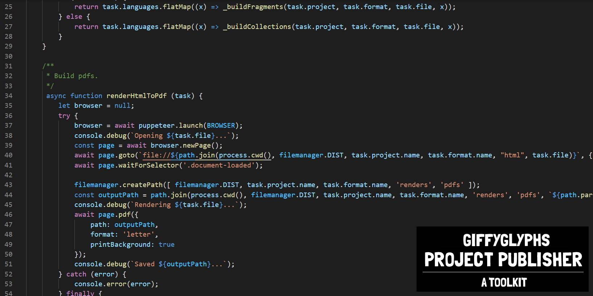

# Changelog

## v2.0.0
* Added GPLv3.0 license.
* Updated to use latest version of Markdown Maker.
* Removed old example formats and projects.
* Added new example format: gppBookWizard.
* Added new example project: gppTutorial.
* Added introduction/tutorial handbook PDF.
* Added changelog and readme.

## v1.0.0
* First working commit of the project.
* Total overhaul of the original _Book Binder_ codebase.
* Fragments are now written in **markdown** and converted into HTML using **marked.js**.
* Added support for four programs: build, clean, watch, and export.
* Can export artifacts in four formats: PDF, PNG, JPG, and ZIP.
* Added basic markdown extensions (page, example, panel, colbreak, pagebreak, etc).
* Added eslint support to check/enforce code standards. Can run with "npm run lint-js".
* Added 2 example formats (basicBookLetter and basicWebsite) and 1 example project (sampleProject).
* Fully documented code with jsdoc. Can generate documentation with "npm run generate-docs".
