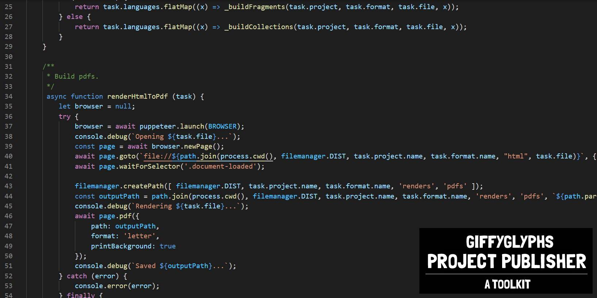

# Giffyglyph's Project Publisher

[](https://www.gnu.org/licenses/gpl-3.0)
[](https://patreon.com/giffyglyph)
[](http://twitter.com/giffyglyph)
[](http://twitch.tv/giffyglyph)

Turn markdown fragments into fully-featured HTML files, PDFs, PNGs, ZIPs, and more with **Giffyglyph's Project Publisher**!

* [Read the Changelog](https://github.com/giffyglyph/giffyglyphs-project-publisher/blob/master/CHANGELOG.md) 
* [Read the Tutorial Handbook](https://github.com/giffyglyph/giffyglyphs-project-publisher/blob/master/publisher-handbook_en.pdf) 

## Getting Started

1. Install **Node.js** and **NPM** (visit https://nodejs.org/en/ for more details).
2. Open a command prompt and go to your _Project Publisher_ installation folder (e.g. "C:/giffyglyphs-project-publisher").
4. Run **npm ci** to install all the required modules.
5. Run **node publisher.js build** to build the example project.
6. Find the built files in **/build/gppTutorial/gppBookWizard/**; open **html/publisher-handbook_v1-0-0_en**.html.

## What Next?

Want to become more familiar with _Project Publisher_? Then try some of the tasks listed below.

1. Make some changes to **projects/gppTutorial/fragments/getting_started.md** and rerun **build**—review your updates in the dist folder.
2. Create a new markdown fragment and add it to **gppTutorial/collections/handbook.json**. Rebuild the project and review the changes.
3. Run **build -fr** to build fragments, not collections.
4. Run **export -ex pdf** to create a PDF from each HTML file.
5. Change the color variables in **gppBookWizard/stylesheets**. Rebuild and review your updates.
6. Create a new project and add it to the **publisher.js** config file.

## Key Commands

These are some of the common commands you can use with _Project Publisher_.

```
a. node publisher.js --help
b. node publisher.js build -p <project> -f <format>
c. node publisher.js build -p <project> -f <format> -fr
d. node publisher.js clean -p <project> -f <format>
e. node publisher.js watch -p <project> -f <format>
f. node publisher.js export -p <project> -ex <png|jpg|png|zip>
```

## Roadmap

To see what's being worked on right now—and what may be planned for the future—check out the **[projects board](https://github.com/giffyglyph/giffyglyphs-project-publisher/projects)**.

## Bugs and Feature Suggestions

If you notice a bug or have a feature suggestion, visit the **[issue board](https://github.com/giffyglyph/giffyglyphs-project-publisher/issues)** and open a ticket. Please make sure to be as thorough as possible in your report and attach screenshots where appropriate, as low-effort tickets may be closed out-of-hand.

## Support

[](https://patreon.com/giffyglyph)
[](http://twitter.com/giffyglyph)
[](http://twitch.tv/giffyglyph)

If you'd like to see more from this project in future, please consider [becoming a patron](https://www.patreon.com/giffyglyph). You can also find more of my work at:

* [giffyglyph.com](https://giffyglyph.com)
* [twitter](https://twitter.com/giffyglyph)
* [twitch.tv/giffyglyph](https://twitch.tv/giffyglyph)

## Licensing

[](https://www.gnu.org/licenses/gpl-3.0)

This work is licensed under [GNU GPL v3.0 or later](https://www.gnu.org/licenses/gpl-3.0.txt) terms.
