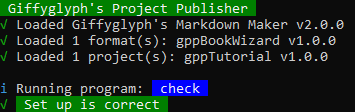

\contentBegin { "class": "page--getting-started" }

# Getting Started

## Installation & First Run

To install and run _Giffyglyph's Project Publisher_ software on your machine, follow these six simple steps:

### Install Node.js { "index": 1 }

First, you must download and install [node.js](https://nodejs.org/en/) v14.17.6. Once installed, run the following terminal commands to verify that both node and [npm](https://www.npmjs.com/) are running correctly:

```
node -v
 npm -v
```

### Install Publisher { "index": 2 }

Next, download the latest release of Publisher (available at [github.com/giffyglyph/giffyglyphs-project-publisher](https://github.com/giffyglyph/giffyglyphs-project-publisher/releases)) and extract the files to a folder on your local machine—for example, "C:/giffyglyphs-project-publisher".

**Example Content:** Publisher comes complete with one example project (gppTutorial) and one example format (gppBookWizard)—find these in the "src" folder.

### Install Modules { "index": 3 }

Now, open up a terminal window and navigate to your _Publisher_ folder. Run the following command to automatically install all prerequisite node modules:

```
npm install
```

### Run your First Command { "index": 4 }

Once all modules are downloaded, run the following command to verify that Publisher is working correctly:

```
node publisher.js check
```

\figureBegin



\figureEnd

If you see "Set up is correct", you're ready to publish!

\columnbreak

\panelBegin { "title": "Publisher Configuration" }

Once installed, open up the **publisher.js** file to check your configuration. There are five main points of interest:

---

1. **Title:** The title to be shown in the command window (i.e. "Giffyglyph's Project Publisher").
2. **Output/Build:** This specifies which folder your build HTML files should be saved to.
3. **Output/Export:** This specifies which folder your exported artifacts should be saved to.
4. **Formats:** This is a list of all formats the software should try to load.
5. **Projects:** This is a list of all projects the software should try to load.

\panelEnd

### Build some HTML { "index": 5 }

You're ready to start building some HTML files! Open up your terminal window, navigate to your Publisher folder, and run the following command:

```
node publisher.js build -p gppTutorial -f gppBookWizard
```

Publisher will read the collection files in the example project (i.e. "src/gppTutorial/collections"), gather the markdown files from the _fragments_ folder, create the HTML, and build/deploy any additional files (stylesheets, fonts, images, etc.).

Once the program is complete, you can find your built files in "build/gppTutorial/gppBookWizard/html".

### Export a PDF { "index": 6 }

After you build some HTML from your markdown, you can _export_ it! Use the following command to create a PDF from your new HTML file:

```
node publisher.js export -ex pdf -p gppTutorial -f gppBookWizard
```

Publisher will gather files from the build folder (i.e. "build/gppTutorial/gppBookWizard") to create a PDF.

Once the program is complete, you can find your new PDF in "export/gppTutorial/gppBookWizard/pdf".

\contentEnd

\contentBegin { "class": "page--getting-started" }

## Running Programs

Publisher is operated by _terminal commands_ which run _programs_. There are five core programs to use—build, export, clean, watch, and check:

### <i class="fas fa-fw fa-hammer"></i> Build

The _Build_ program turns your raw markdown into HTML, creates CSS stylesheets from your SASS, and deploys any additional content required by your artifacts—scripts, fonts, images, etc.

**Fragments and Collections:** By default, _Build_ looks at your _collections_ to decide a) _which_ markdown files it should use and b) _how_ to package them. But if you want to build individual fragments instead (i.e. for testing or development), use the "-fr" option (listed below).

```
node publisher.js build
```

\tableBegin { "class": "table--build" }

| Option | Description |
| ----------- | ----------- |
| -p, --projects <name...> | One or more loaded projects. |
| -f, --formats <name...> | One or more loaded formats. |
| -l, --languages <code...> | One or more languages. |
| -t, --tasks <task...> | Run a selection of build sub-tasks (html, stylesheets, scripts, fonts, images, or vendors). |
| -fi, --files <name...> | Build specific files. |
| -fr, --fragments | Build as fragments only. |
| -c, --clean | Run _Clean_ before building. |
| -w, --watch | Run _Watch_ after building. |
| -d, --debug | Show debug information. |
| -di, --discrete | Use no colors in the log. |
| -h, --help | List all program options. |

\tableEnd

### <i class="fas fa-fw fa-file-export"></i> Export

The _Export_ program turns your built HTML into artifacts—PDF, PNGs, JPGs, or ZIPs.

**Build First:** Export uses files from the build folder, so make sure to run a fresh _Build_ before you try exporting.

```
node publisher.js export
```

\tableBegin { "class": "table--export" }

| Option | Description |
| ----------- | ----------- |
| -p, --projects <name...> | One or more loaded projects. |
| -f, --formats <name...> | One or more loaded formats. |
| -fi, --files <name...> | Export specific files. |
| -ex, --export | Type of export (pdf, png, jpg, or zip). |
| -pg, --pages <pages> | Export a specific page range. |
| -d, --debug | Show debug information. |
| -di, --discrete | Use no colors in the log. |
| -h, --help | List all program options. |

\tableEnd

\columnbreak

\panelBegin { "title": "Parallel Activity" }

Some command options allow you to specify a space-separated list of names/codes/tasks/etc. Publisher will run multiple jobs _in parallel_, saving you time when running bulk actions.

**Defaulting to All:** Some options (projects, formats, tasks) default to "all" if unspecified.

\panelEnd

### <i class="fas fa-fw fa-trash"></i> Clean

The _Clean_ program deletes build and export folders. This program is commonly used to clear out old artifacts before a build.

```
node publisher.js clean
```

\tableBegin { "class": "table--clean" }

| Option | Description |
| ----------- | ----------- |
| -p, --projects <name...> | One or more loaded projects. |
| -f, --formats <name...> | One or more loaded formats. |
| -d, --debug | Show debug information. |
| -di, --discrete | Use no colors in the log. |
| -h, --help | List all program options. |

\tableEnd

### <i class="fas fa-fw fa-eye"></i> Watch

The _Watch_ program keeps an eye on source files and folders—when any change is detected, a _Build_ is then automatically triggered. This can be useful when 

```
node publisher.js watch
```

\tableBegin { "class": "table--watch" }

| Option | Description |
| ----------- | ----------- |
| -p, --projects <name...> | One or more loaded projects. |
| -f, --formats <name...> | One or more loaded formats. |
| -t, --tasks <task...> | Trigger a selection of build sub-tasks (html, stylesheets, scripts, fonts, images, or vendors). |
| -fi, --files <name...> | Watch specific files. |
| -fr, --fragments | Build as fragments only. |
| -d, --debug | Show debug information. |
| -di, --discrete | Use no colors in the log. |
| -h, --help | List all program options. |

\tableEnd

### <i class="fas fa-fw fa-tasks"></i> Check

The _Check_ program confirms that your Publisher configuration is working, verifying the core configuration and any specified formats/projects.

```
node publisher.js check
```

\contentEnd