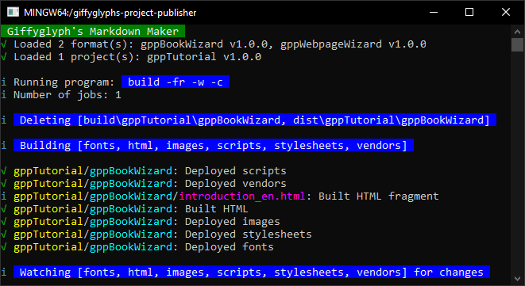

\contentBegin { "class": "page--introduction" }

# Giffyglyph's Project Publisher

## What is Publisher?

_Giffyglyph's Project Publisher_ (aka Publisher) is a fully-featured content pipeline and CLI tool that turns [markdown documents](https://www.markdownguide.org/getting-started/) into HTML, PDFs, PNGs, and more in just five simple steps:

1. **Start** a new Publisher project and choose one or more rendering formats—are you making a book, post, webpage, or website?
1. **Write** a document in plain-text markdown.
2. **Enrich** it with stylesheets, scripts, and translations. 
2. **Build** HTML files from your document.
3. **Export** your HTML as PDFs, PNGs, JPGs, or ZIPs.

When you want to write, refine, and release markdown documents, Publisher has you covered.

\figureBegin { "caption": "The <i>Project Publisher</i> CLI window", "class": "figure--cli" }

\figureEnd

\panelBegin { "title": "Formats & Projects" }

Publisher relies on two categories of content:

---

1. **Formats:** "What _type_ of content am I trying to publish, and how should it behave?" Formats are reusable "skins" that define the basic shape, functionality, and appearance of your projects.
2. **Projects:** "What _actual_ content I am trying to publish?" Projects are where you put your text and anything else you might want to override the underlying format with (stylesheets, fonts, images, scripts).

---

By dividing your content into formats and projects, you can build your own library of reusuable publishing components.

\panelEnd

\columnbreak

### <i class="fas fa-fw fa-pen"></i> Write in Markdown

Create documents with [markdown](https://www.markdownguide.org/getting-started/)—a flexible, easy-to-learn/easy-to-master, plain text markup language.

Need to use some specific HTML in your document as well? No problem—markdown supports HTML too!

### <i class="fas fa-fw fa-print"></i> Build HTML

Turn your markdown into fully-featured HTML pages with _rendering formats_. These formats come in one of four categories:

* **Book:** Render markdown as standard-sized _pages_ that are bound into a _book_.
* **Post:** Render markdown as _posts_ that can be of varying size, shape, style, etc.
* **Webpage:** Render markdown as a single webpage.
* **Website:** Render markdown as a multi-page website complete with navigation. 

You can assign multiple formats to each project and build them all _simultaneously_ with one command.

### <i class="fas fa-fw fa-file-export"></i> Export Artifacts

Export and share your rendered HTML files as PDFs, PNGs, JPGs, and ZIPs.

Formats can be configured to export files with varying options, and you can easily extend a format with new export options if-and-when the need arises.

\exampleBegin

Valiant wants to write a short 10-page campaign primer for a D&D game he's running. He creates a new project, writes the text in simple markdown, renders it using a premade "book" format, and exports it as a PDF for his players to read.

Some time later, Valiant decides to release the primer online as a website for others to read. He renders it using a "website" format, exports it as a ZIP, and uploads the files to his webhost.

\exampleEnd

### <i class="fas fa-fw fa-palette"></i> Style with SASS

Want to change how your documents look for a more _personal_ touch? It's easy with [SASS stylesheets](https://sass-lang.com/)!

Make some small tweaks (swap some colors, change fonts, add a new theme, etc.) or go all-in and completely overhaul the layout of your content.

\contentEnd

\contentBegin { "class": "page--introduction" }

\exampleBegin

Clanda is working on a new TTRPG and wants to create some _posts_ for her social media. She creates a new project with a "post" format and adds _custom stylesheets_, changing the color scheme and font choices to better match the theming of her TTRPG.

\exampleEnd

### <i class="fas fa-fw fa-comment"></i> Language Translations

Translate your content into other languages with message keys and translation files, and render translated copies of your HTML with no additional effort.

### <i class="fas fa-fw fa-cogs"></i> Scripts and Scripting

It's easy to transform, extend, and automate your markdown documents—just use [javascript](https://www.javascript.com/)!

Add third-party libraries (jQuery, moment.js, bootstrap, etc.) or create your own scripts to use custom features and functionality. With _JSON renderers_, you can even write JSON objects directly into your markdown.

### <i class="fas fa-fw fa-layer-group"></i> Fragments & Collections

Use Publisher to break up large documents into small, easy-to-manage _fragments_. You can bind these fragments together in any fashion with _collections_.

### <i class="fas fa-fw fa-puzzle-piece"></i> Extensions

Formats allow you to customise almost every part of Publisher—change how HTML is rendered, create new export types, override how markdown is parsed, etc. 

Create your own publishing formats to suit your own bespoke projects, or import them from the community.

## Why use Publisher?

If any of the following sound familiar to you, then _Publisher_ might be a good fit for your projects:

* I want to write in plain text.
* I want to change the appearance of my content.
* I want to automate parts of my text.
* I want full control of my project code.
* I want to break up a monolithic document into smaller fragments for easier management.
* I want to publish my content in multiple formats.
* I want to translate my content into other languages.
* I want to export and share my work easily with others.
* I want to import new formats from the community and use them in my own projects.

Use Publisher when you want total control over your content and how it's produced.

\columnbreak

### Published Examples

This handbook was written for, rendered in, and exported by _Giffyglyph's Project Publisher_. Other examples of Publisher-authored projects include:

* **Darker Dungeons:** A _D&D 5e_ book ([PDF](https://drive.google.com/file/d/1ufAyAnP4YTyJmOvyFQwnJZoTMTe95ETt/view), [website](http://giffyglyph.com/darkerdungeons/grimoire/4.0.0/en/)).
* **Monster Maker:** A _D&D 5e_ book ([PDF](https://drive.google.com/file/d/1BKZcrdUeeZCiG8WjC1E_Pxr1LCpaGbfY/view), [website](http://giffyglyph.com/monstermaker/grimoire/2.1.2/en/)).
* **Class Compendium:** A _D&D 5e_ book ([PDF](https://drive.google.com/file/d/1uyV8AWvsDQ3jKMpeXn7ZhlPXM8slg_yv/view), [website](http://giffyglyph.com/classcompendium/grimoire/1.1.0/en/)).
* **Card Codex:** A _D&D 5e_ supplement ([PDF](https://drive.google.com/file/d/1h32q-Dn-vRMMOVWZhBSuV4pRYc120kVD/view)).
* **Quick Quest:** A rules-lite RPG system ([PDF](https://drive.google.com/file/d/1IlD57ncSyQp6QOtpN1G2V-8qxKLliNJF/view)).
* **Giffyglyph's Project Posts:** A visual log of project status updates ([PNGs](https://pbs.twimg.com/media/E-JOgi5WQAcKO8P?format=jpg&name=4096x4096)).

## License

Publisher (and the underlying _Markdown Maker_ engine) is released under a [GNU GPL v3.0 license](https://www.gnu.org/licenses/gpl-3.0.txt). In summary:

<!-- Any artifacts you produce with this software—PDFs remain your own exclusive content. -->

* You may copy, modify and distribute this software.
* You must include the license and copyright notice with each and every distribution.
* Any modifications of this code base MUST be distributed with the same license—GPLv3.
* This license does _not_ cover your own formats, projects, or artifacts (PDFs, PNGs, etc.)—anything you create using this software remains your own work.

## Support

If you'd like to see more from this tool—or would like to commission a custom format for your project—consider [becoming a patron](https://patreon.com/giffyglyph) or making a [one-off donation](https://ko-fi.com/giffyglyph).

	<a href="https://www.patreon.com/bePatron?u=12684623" class="btn btn--patreon"><i class="fab fa-fw fa-patreon"></i> Become a patron</a>
	<a href="https://ko-fi.com/P5P3DUKK" class="btn btn--kofi"><i class="fas fa-fw fa-mug-hot"></i> Buy me a coffee</a>
	<a href="https://giffyglyph.com" class="btn btn--contact"><i class="fas fa-fw fa-link"></i> Contact Me</a>

\panelBegin { "title": "Special Thanks" }

This tool was made possible with the support of:

---

Adam Mote, Ady Veisz Dragia, AlDragonus, Alexander von Bose, Anthony Campla, Arthur Bauer, Barkston, Berke Canatar, Birb Marrows, damon1245, Dario Hajic, FC Wesel, Faolan Twinbear, Hoots Kenku, Michael C. Miller, Necrotic Fawn, Strider

---

...and 393 other patrons.

\panelEnd

\contentEnd
